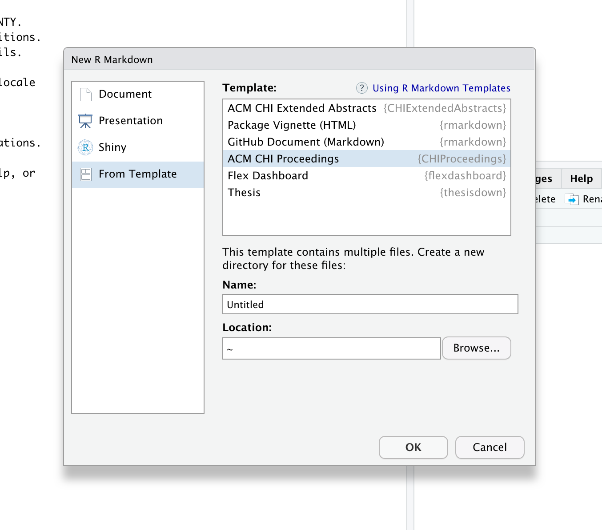
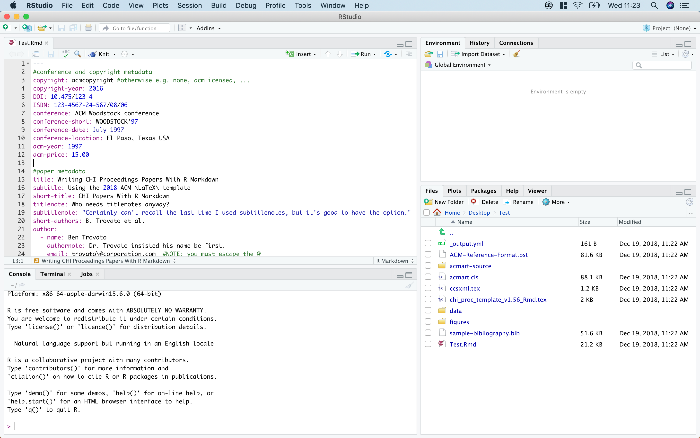
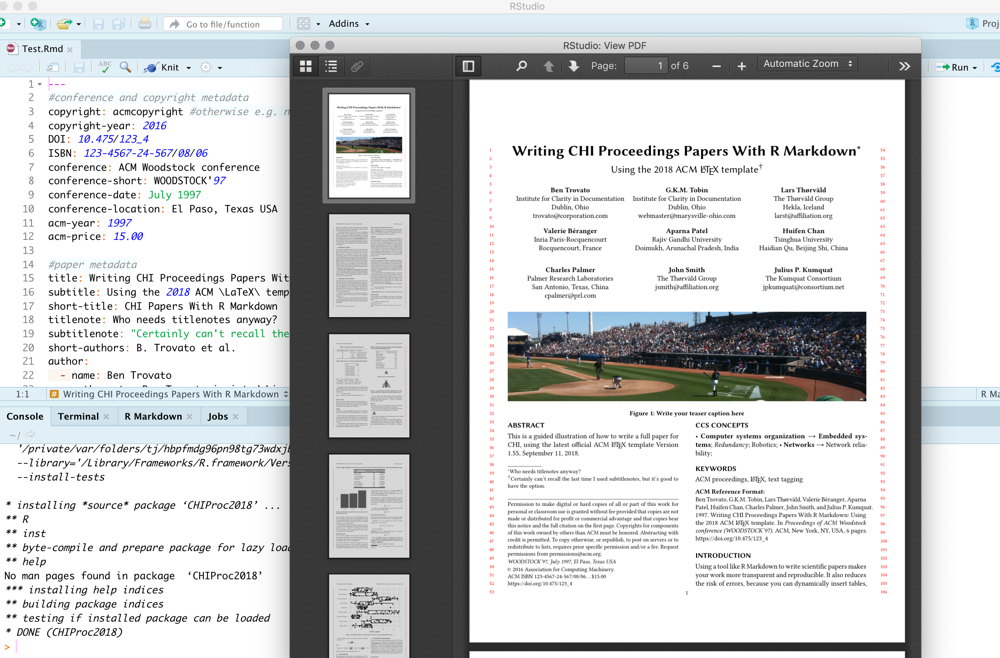
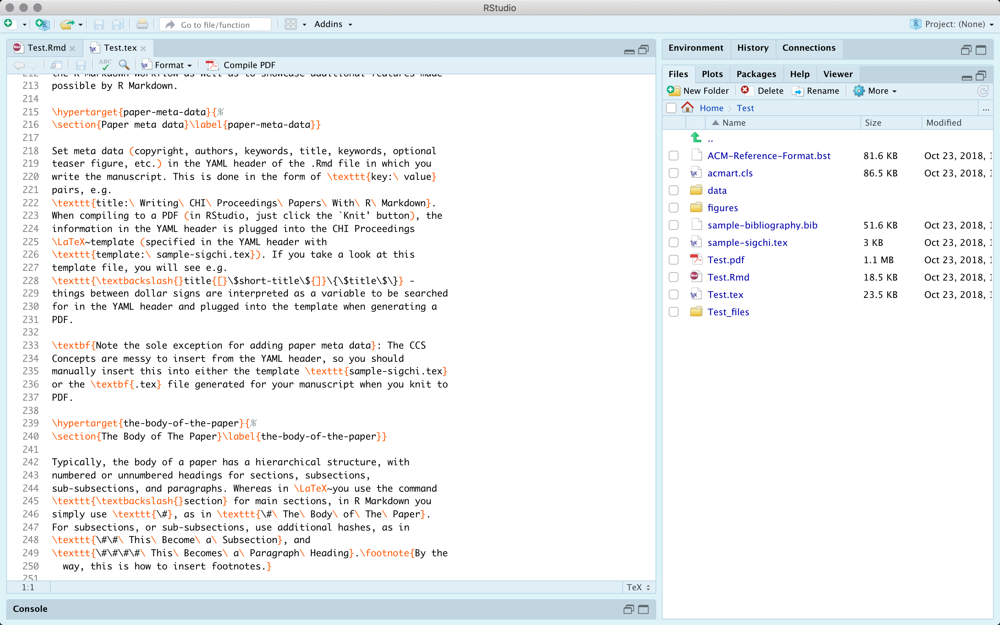

# ACM CHI Proceedings R Markdown Template
This R package provides a template for writing ACM CHI Proceedings papers in R Markdown, and compiling to PDF via the LaTeX templates from the ACM Master Article Template (v. 1.56).

## Overview
Using a tool like [R Markdown](https://rmarkdown.rstudio.com) to write scientific papers makes your work more transparent and reproducible, and reduces the risk of introducing errors by manually transfering results from statistical software to manuscript.

However, getting R Markdown to [play nicely with the latest ACM LaTeX templates can be tricky](https://ulriklyngs.com/blog/acm-articles-with-r-markdown).

This R package makes it easy, by providing a ready-made .Rmd template with YAML metadata and body text illustrations of what you need to know, which compiles to the latest CHI Proceedings (used for CHI'19 submissions) format via the [ACM Master Article LaTeX template](https://www.acm.org/publications/proceedings-template).

## Installation
``` r
# The package isn't on CRAN - install the development version from GitHub:
# install.packages("devtools")
devtools::install_github("ulyngs/chi-proc-rmd-template")
```

## Usage
The easiest way to use the template is with RStudio, via File -> New File -> R Markdown...
In the dialog box, click 'From Template', then find the new 'ACM CHI Proceedings {CHIProceedings}' option, choose a name for your manuscript (e.g. 'Test'), then click OK:


A new folder named *Test* is created, and you see an open **Test.Rmd** file:


If you click 'Knit', it compiles to the example PDF output with the illustration content from **Test.Rmd**:


It also keeps the intermediary generated **Test.tex** file from which the PDF output was created:


Now go ahead and replace the content of **Test.Rmd** with your own fantastic work! **NOTE: include the initial *setup_output* at the top of your file, which creates custom chunk options that allow you to e.g. add image descriptions for visually impaired readers.**
